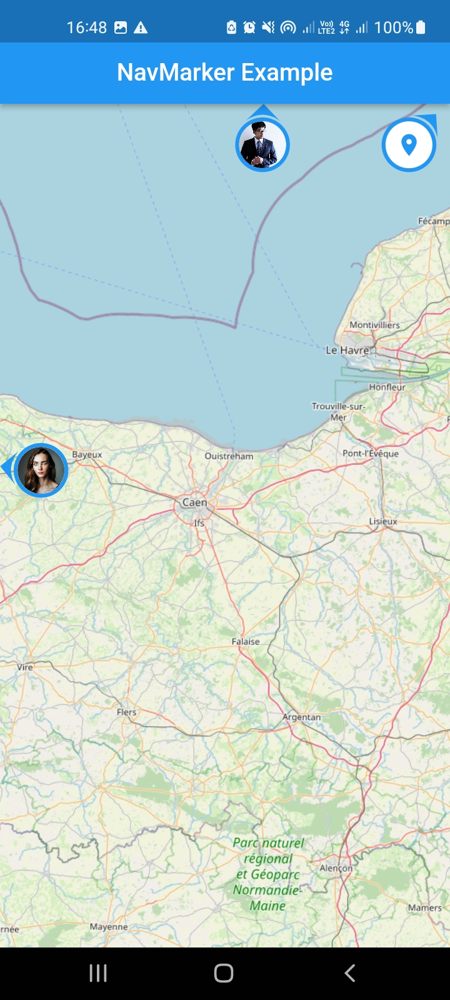
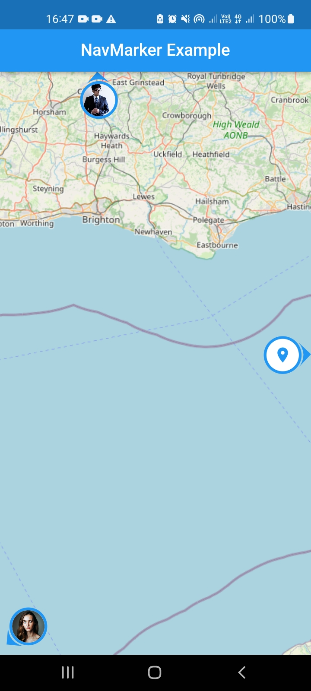

# nav_marker

`nav_marker` is a Flutter package that enables navigation of markers on `flutter_map`
<!-- and `Google Maps for Flutter`. -->

## Previews
<table>
    <tr>
        <td></td>
        <td></td>
        <td></td>
    </tr>
</table>


## Features

- Define dynamic markers with navigator widget
- Display a navigator directs user towards the marker position.
- Customize the appearance of the navigator to match the marker.

## Getting started

Before using the `nav_marker` package, make sure you have installed and set up `flutter_map` in your Flutter project. If you haven't done so, please refer to the official [flutter_map documentation](https://docs.fleaflet.dev/getting-started/installation) for installation instructions.

## Usage
Import the necessary packages in your Dart file:
```dart
import 'package:flutter_map/flutter_map.dart';
import 'package:latlong2/latlong.dart';
import 'package:nav_marker/nav_marker.dart';
```
Set up your map view using FlutterMap and specify the initial map options, following the instructions provided in the [flutter_map documentation](https://docs.fleaflet.dev/#demonstration).

Then add the `NavMarkerLayer` to the `children` property of `FlutterMap`

```dart
FlutterMap(
    options: MapOptions( ... ),
    children: [
        TileLayer( ... ),
        NavMarkerLayer(
            navMarkers: [
                ...
            ]
        ),
    ],
),
```

> Caution: Make sure to place the `NavMarkerLayer` **below** the `TileLayer`.

The `NavMarkerLayer` consists of `NavMarker` in children property, allowing to easily add NavMarkers as follow:

```dart
NavMarkerLayer(
    navMarkers: [
        NavNarker(
            navigator: true,
            builder: (_) => builder,
            point: point,
        ),
        NavNarker(
            navigator: true,
            builder: (_) => builder,
            point: point,
        ),
    ]
),
```

> Note: If the `navigator` property is undefined or set to false, the `NavMarker` will not be displayed, similar to a regular `Marker`.

Furthermore, you can customize the appearance of the navigator by defining the `navOptions` property including an `onTap` function.

```dart
NavNarker(
    navigator: true,
    navOptions: NavigatorOptions(
        onTap: (targetPoint) => onTap,
        arrowColor: arrowColor,
        backgroundColor: backgroundColor,
        surfaceColor: surfaceColor,
        size: size,
        child: child,
    ),
    builder: (context) => builder,
    point: point,
)
```

## Todo-list
- [ ] Enhance the precision of the direction arrows.
- [ ] Add support for map rotation in flutter_map.
- [ ] Develop a version that supports Google Maps.
- [ ] Develop a version that supports integration with other packages.